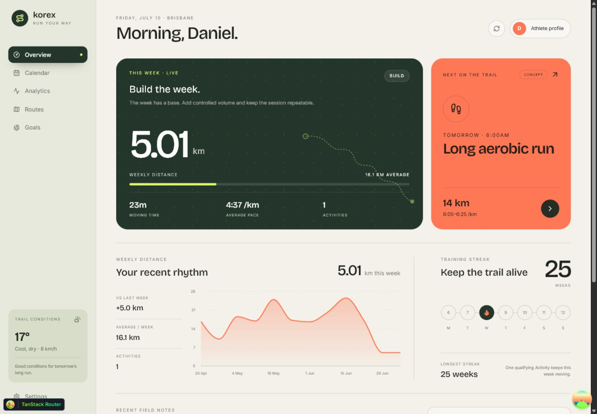
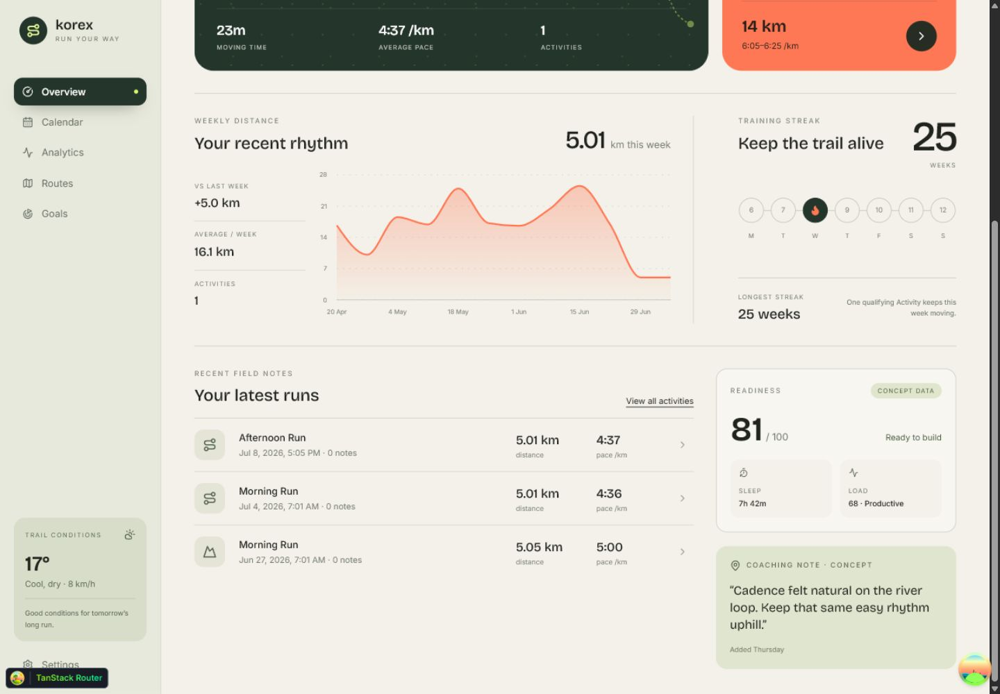

# Korex Design Language

> **Field Journal** — trail telemetry recorded with the confidence of a coach,
> not the chrome of a SaaS dashboard.

This document is the source of truth for why Korex looks and sounds the way it
does. **Trail Telemetry** remains the brand foundation. **Field Journal** is the
chosen desktop expression of that foundation: warm, physical, data-led, and
structured like a runner's working notebook.

The desktop reference is currently implemented at `/new-dashboard`. Mobile
continues to use the existing Trail Telemetry layouts until the Field Journal
patterns are deliberately translated to smaller screens.

---

## 1. Core idea

Korex turns imported training data into something a runner feels ownership
over. The interface should feel like an outdoor coaching tool assembled from
routes, weekly rhythm, annotations, and measured effort. It should not feel like
an admin panel with fitness data poured into it.

Field Journal is defined by:

- **Editorial hierarchy:** one clear story about the current week, followed by
  evidence and recent entries.
- **Physical rhythm:** paper-like canvas, open sections, ruled dividers, large
  margins, and a small number of strong surfaces.
- **Trail telemetry:** route lines, waypoint dots, streak tracks, and charts are
  both the data and the decoration.
- **Coach voice:** concise, specific, and forward-looking.
- **Semantic colour:** components consume theme roles; light and dark palettes
  define how those roles appear.

Colour contributes atmosphere, but colour is not the design language. A theme
may change the palette without changing the Field Journal identity.

---

## 2. Principles

1. **Numbers are heroes.** Distance, pace, time, streaks, and counts are the
   product. Set the primary number large, use tabular figures, and keep its unit
   subordinate.
2. **Tell the week as a story.** Lead with current focus and volume. Follow with
   the distance rhythm, streak, and recent Activities. Do not give every metric
   equal visual weight.
3. **Fewer surfaces, more rhythm.** Prefer whitespace and hairline rules. Use a
   filled surface only when it establishes a meaningful mode: coaching focus,
   planned work, selection, or a compact utility.
4. **The trail is the motif.** Route lines and waypoints express progress,
   continuity, history, and future intent. Do not add unrelated decorative
   geometry.
5. **Speak like a coach.** Use short, active phrases: “Build the week.” “Start
   simple.” “Keep the trail alive.”
6. **Live data earns prominence.** The hero, charts, streak, and Activity log
   should use Korex-owned data. Future capabilities must be labelled as
   concepts until the domain and API exist.
7. **Theme roles, not colour literals.** Production components use semantic
   tokens. Light/dark differences belong in the theme definitions, not scattered
   `dark:` classes.
8. **Desktop can be dense without being busy.** Use broad horizontal groupings,
   not a uniform grid of small cards.

---

## 3. Desktop reference

### Primary composition



The reference composition uses a quiet field rail, an editorial greeting, one
dark weekly-focus surface, one contrasting planned-session surface, and an open
telemetry band. The weekly number is the strongest object on the page.

### Training detail



Distance and streak share one ruled section because they both describe weekly
continuity. The Activity log reads as journal entries rather than a generic
data table. Supporting concepts sit to the side and never outrank live data.

These screenshots are composition references, not colour specifications. The
current implementation still contains prototype colour literals. Before the
design replaces a production route, those literals must be mapped to the theme
contract in section 7.

---

## 4. Brand DNA

- **Domain:** trail and road running telemetry — Activities, routes, weekly
  rhythm, Training Streaks, Training Goals, Heart Rate Zones, and Personal Best
  Efforts.
- **Material:** field notes, contour maps, trail markers, ruled paper, weathered
  equipment, and early-morning light.
- **Temperature:** earthy and human rather than clinical or tech-blue.
- **The mark:** two ascending diagonal strokes ending in waypoint dots. The
  route-and-waypoint form is the brand; its colour is theme-dependent.
- **Imagery:** golden-hour runners, mountains, and real route geometry. Imagery
  is supporting texture, not a substitute for useful data.

---

## 5. Typography

| Role | Family | Usage |
| --- | --- | --- |
| Display | **Bricolage Grotesque Variable** (`font-display`) | Headlines, hero numbers, section titles, wordmark |
| Body | **Inter Variable** (`font-sans`) | Paragraphs, labels, navigation, controls |

Rules:

- Large metrics use `font-display tabular-nums` with tight tracking.
- Units are one or two steps smaller and use muted foreground colour.
- Section eyebrows use uppercase text around `10px` with `0.16–0.2em`
  tracking. They orient the page; they are not headings by themselves.
- Body copy stays compact. The weekly-focus explanation should normally fit in
  two lines on desktop.
- Avoid adding another type family. Character comes from scale and contrast,
  not a larger font palette.

---

## 6. Motif system

The route line and waypoint remain the shared visual grammar.

- **Route accent:** an ascending or traversing line ending in a waypoint. Use in
  the weekly hero and important progress moments.
- **Waypoint:** filled means reached or active; hollow means open, future, or no
  qualifying data.
- **Streak track:** connected waypoints represent continuity. A qualifying
  Activity changes the relevant waypoint; do not replace this with seven
  disconnected badges.
- **Route texture:** faint map-like dots or lines can add depth to a hero. Keep
  them low contrast and theme them with `currentColor` or a semantic token.
- **Chart trail:** line and area charts should look like a traced route. Use one
  strong series colour, restrained grid lines, and direct summary metrics.
- **Ruled divider:** a hairline separates journal sections. It should usually do
  the work a card border would otherwise do.

Existing primitives in `apps/web/src/components/brand.tsx` include
`RouteAccent`, `StrideTexture`, `SectionLabel`, `WaypointDot`, and
`RouteProgress`. Reuse or evolve these before creating one-off decoration.

---

## 7. Colour and theme contract

### 7.1 Shadcn is the base vocabulary

Korex themes are defined in `packages/ui/src/styles/globals.css` using Shadcn's
semantic variables. Components should use Tailwind classes backed by these
variables rather than literal colour values.

| UI responsibility | Shadcn token(s) | Typical Tailwind use |
| --- | --- | --- |
| Page canvas and ink | `background`, `foreground` | `bg-background text-foreground` |
| Open or inset surfaces | `card`, `card-foreground` | `bg-card text-card-foreground` |
| Quiet blocks and metadata | `muted`, `muted-foreground` | `bg-muted text-muted-foreground` |
| Main actions and focus | `primary`, `primary-foreground` | `bg-primary text-primary-foreground` |
| Secondary controls | `secondary`, `secondary-foreground` | `bg-secondary text-secondary-foreground` |
| Hover and selection | `accent`, `accent-foreground` | `bg-accent text-accent-foreground` |
| Rules and control outlines | `border`, `input`, `ring` | `border-border ring-ring` |
| Destructive meaning only | `destructive`, `destructive-foreground` | destructive actions and errors |
| Data series | `chart-1` through `chart-5` | chart stroke, fill, legend |
| Navigation rail | `sidebar-*` | Shadcn Sidebar components and rail states |

Do not use `primary`, `destructive`, or chart colours merely because they look
right in one theme. Their meaning must remain stable across the app.

### 7.2 Field Journal aliases

Shadcn does not name the three signature Field Journal surfaces. Add a small
app-level semantic layer rather than leaking palette values into components.

| Alias | Responsibility | Recommended base mapping |
| --- | --- | --- |
| `journal-hero` / `journal-hero-foreground` | Weekly coaching focus surface | `sidebar` / `sidebar-foreground` |
| `journal-plan` / `journal-plan-foreground` | Planned or recommended session | `chart-5` plus a tested contrast foreground |
| `journal-route` | Route traces, progress line, active waypoint | `sidebar-primary` or the appropriate chart series |

Example theme wiring:

```css
:root {
  --journal-hero: var(--sidebar);
  --journal-hero-foreground: var(--sidebar-foreground);
  --journal-plan: var(--chart-5);
  --journal-plan-foreground: var(--accent-foreground);
  --journal-route: var(--sidebar-primary);
}

@theme inline {
  --color-journal-hero: var(--journal-hero);
  --color-journal-hero-foreground: var(--journal-hero-foreground);
  --color-journal-plan: var(--journal-plan);
  --color-journal-plan-foreground: var(--journal-plan-foreground);
  --color-journal-route: var(--journal-route);
}
```

This keeps production markup readable:

```tsx
<section className="bg-journal-hero text-journal-hero-foreground" />
<aside className="bg-journal-plan text-journal-plan-foreground" />
```

Themes may override the aliases directly when the base mapping does not provide
enough contrast or distinction. Every alias must have a light and dark outcome.

### 7.3 Theme implementation rules

- Define palette values in `:root` and `.dark`; components consume semantic
  classes only.
- Do not solve ordinary theming with feature-level `dark:bg-*` or `dark:text-*`.
  Use `dark:` only for a genuinely different visual treatment, not a palette
  substitution.
- Replace prototype classes such as `bg-[#24352c]` and `text-[#777d73]` before
  promotion to production.
- SVG motifs use `currentColor`, CSS variables, or token-driven props.
- Chart gradients reference `var(--color-chart-*)` or `journal-route`; never
  embed hex values inside chart components.
- Opacity may soften a semantic colour, but it must not create unreadable text
  or controls.
- Test text and interactive states for WCAG AA contrast in both themes.
- Never communicate good, warning, selected, or completed state with colour
  alone. Pair colour with copy, icon, shape, or position.

---

## 8. Desktop layout

### Shell

- The expanded desktop field rail is approximately `14–15rem` wide.
- The rail is quieter than the page's primary content. It can use Shadcn
  `sidebar-*` tokens while retaining the Field Journal spacing and active
  waypoint.
- The rail may stay fixed while the journal scrolls.
- Navigation uses real links and recognizable icons. Active state combines a
  filled surface, stronger text, and a waypoint.

### Dashboard hierarchy

1. **Journal header:** date, location, greeting, sync, and athlete access.
2. **Weekly lead:** approximately two-thirds coaching hero and one-third planned
   session on wide screens.
3. **Telemetry band:** weekly-distance trend and Training Streak share one open,
   ruled section.
4. **Journal entries:** recent Activities are the main column; secondary context
   sits in a narrower aside.

The weekly lead may use large rounded surfaces. The telemetry and Activity
sections should remain mostly open. Avoid turning each metric into an equal card.

Desktop is the current Field Journal scope. Do not infer a mobile layout by
simply stacking every desktop panel. Mobile needs a deliberate hierarchy pass.

---

## 9. Component patterns

### Weekly focus hero

- Uses live `Dashboard This Week` data.
- Contains one hero number, a compact coaching statement, and no more than three
  supporting metrics.
- A route texture may decorate the surface but must not obscure data.
- Progress is compared against a clearly named target or baseline. Never show a
  bar whose denominator is unclear.

### Planned session

- Visually contrasts with the weekly hero.
- Names time, distance, and intended pace or effort.
- Must carry a **Concept** label until Korex owns a planning domain and API.
- A concept action must not imply that it will persist data.

### Weekly distance

- Uses the API-provided bucket range; copy must not claim a fixed number of weeks
  unless the data is explicitly sliced to that range.
- Shows current distance, comparison, weekly average, and Activity count before
  the graph.
- The newest bucket includes the current in-progress Training Week.
- Tooltip copy distinguishes the current week from completed weeks.

### Training Streak

- Uses a connected waypoint track for the seven current-week days.
- Filled waypoints identify days with Qualifying Activities.
- Current and longest streak are distinct metrics.
- Empty days are neutral, not failures, while the Training Week is in progress.

### Activity journal

- Each row has a route/activity mark, Activity name, time, note count, distance,
  and pace.
- Rows link to the Korex-owned Activity route.
- Prefer dividers and alignment over individual cards.
- Empty copy frames the first Activity as a beginning.

### Concept data

- Readiness, weather, coaching notes, and planned sessions are concepts until
  their domain and source exist.
- Mark concepts visibly near their label; do not rely on documentation alone.
- Concept data must never be presented as user-entered or provider-derived data.

---

## 10. Voice and tone

- Terse, active, and encouraging.
- Time-aware when the source is reliable.
- Prefer a useful observation over praise.
- Sentence fragments are welcome in headings.
- Empty states describe the next useful move, not an error condition.
- Avoid corporate language, gamified hype, and vague motivation.

Examples:

- “Build the week.”
- “Keep the trail alive.”
- “Your next Activity starts the field notes.”
- “No weekly distance yet.”

---

## 11. Imagery and texture

Most identity should remain code-driven so it can follow themes.

- Prefer SVG route marks, waypoint tracks, and token-driven chart fills.
- Use raster photography only when it adds emotion or spatial context.
- Existing golden-hour assets live under `apps/web/public/dashboard/`.
- Empty-state art should use transparent backgrounds and semantic foreground
  colours where possible.
- Avoid embedding a light canvas into raster assets; it will break dark themes.

---

## 12. Scope and status

- **Mobile:** Trail Telemetry is implemented across the mobile application and
  remains the current mobile reference.
- **Desktop direction:** Field Journal was selected from the dashboard design
  prototype and is available at `/new-dashboard`.
- **Live in the reference:** athlete identity, sync, weekly focus and metrics,
  weekly distance, Training Streak, and recent Activities.
- **Concepts in the reference:** weather, readiness, next session, and coaching
  note. These are visibly labelled where they could be mistaken for live data.
- **Before replacing `/dashboard`:** move colour literals to semantic tokens,
  verify both themes, add production loading/error states, and decide which
  Field Journal shell patterns should become shared components.
- **Shared primitives:** continue evolving `components/brand.tsx`; promote stable
  primitives to `packages/ui` only after they are used beyond one feature.

---

## 13. Do / don't

### Do

- Make the week's key number the strongest visual object.
- Use real Korex domain language and live data wherever it exists.
- Build hierarchy with type, spacing, rules, and a few intentional surfaces.
- Map production colours to Shadcn semantic tokens.
- Define light and dark palettes centrally.
- Use route and waypoint motifs to express real state.
- Label concepts at the point of use.

### Don't

- Ship prototype hex utilities as the production theme system.
- Add per-component dark-mode colour patches.
- Wrap every metric in a bordered card.
- Use colour alone to explain state.
- Invent a new decorative motif for each feature.
- Treat a Weekly Training Summary as the live source for dashboard analytics.
- Present mocked coaching or readiness values as live user data.

---

## 14. Productionisation checklist

- [ ] Map all Field Journal colour literals to Shadcn or `journal-*` tokens.
- [ ] Define and visually verify light and dark token values.
- [ ] Confirm text, charts, focus rings, and hover states meet contrast targets.
- [ ] Replace the isolated shell with production navigation without losing the
      Field Journal hierarchy.
- [ ] Preserve live loading, empty, error, and syncing states.
- [ ] Verify chart tooltips and route motifs in both themes.
- [ ] Decide which concept surfaces have approved domain/API work.
- [ ] Translate the hierarchy to mobile separately; do not mechanically stack
      the desktop design.
